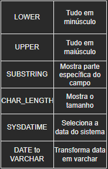

# COMANDOS DQL PARTE 1 - O SELECT
DQL é a abreviação de *"Data Query Language"*, que significa "Linguagem de Consulta de Dados". Por meio dela, é possível consultar os dados da tabela e seu principal (e único) comando é o **SELECT**. Porém, selecionar dados é complexo. Dependendo das necessidades da situação, é possível fazer essa seleção de inúmeras maneiras. Com isso, aqui na colinha, o tópico está dividido em cinco partes:

1. **WHERE**, **AS**, Funções e Operadores
2. Os **JOINS** (inner, left, right)
3. **ORDER BY**, **GROUP BY** e **HAVING**
4. Funções de Agregação
5. **distinct**, **union** e criar **views**

> OBS: Todo select possui **FROM**, pois ele especifica em qual tabela acontecerá o select. 


## WHERE
Especifica a condição do select. 
Exemplo:
```sql
select * from tb_aluno where nota > 4;
```
Nesse caso, usamos o operador aritmético ">", mas outros itens podem ser utilizados para filtrar e/ou alterar a seleção.

### Funções
Algumas funções são utilizadas para alterar visualmente os selects, numa espécie de formatação. Seguem aqui alguns exemplos:



### Operadores
Na clausula **WHERE**, há algumas especificações que podem ser feitas.
- **IN**
```sql
# o código deve estar
select codigo from tb_aluno where codigo in (1,4);
```
- **NOT**:
```sql
# o código NÃO deve estar
select codigo from tb_aluno where codigo not in (1,4);
```
- **BETWEEN**
```sql
# vai selecionar entre 1 e 3
select codigo from tb_aluno where codigo between "1" and "3";
```
- **LIKE**
```sql
# começa com F
select nome from tb_aluno like "F%"; 
# ou
# termina com F
select nome from tb_aluno like "%F"; 
# ou ainda
# possui F no meio
select nome from tb_aluno like "%F%"; 
```
- **">"**, **"<"**, **">="** e **"<="**
```sql
# só vai mostrar se:
# for MAIOR que 6:
select codigo from tb_aluno where codigo > 6; 
# for MENOR que 6:
select codigo from tb_aluno where codigo < 6; 
# for menor OU igual a 6:
select codigo from tb_aluno where codigo <= 6; 
# for maior OU igual a 6:
select codigo from tb_aluno where codigo >= 6; 
```
- **and**, **not** e **in**
```sql
# duas condições:
select codigo from tb_aluno where codigo = 4 and nota = 10; 
# uma ou a outra:
select codigo from tb_aluno where codigo = 4 or nota = 10; 
# inverte a lógica:
select codigo from tb_aluno where codigo = 4 and not nota = 10; 

```
## AS
O **AS** serve para dar apelidos (nomes temporários) a campos ou tabelas. Com os apelidos, um join pode se tornar mais fácil ou intuitivo. 

```sql
# coluna
select nome_aluno as aluno from tb_aluno; 
# tabela
Select t1.nome_car t1, t1.vlhora_car
from cargo t1

```
[Voltar ao início](./README.md)
